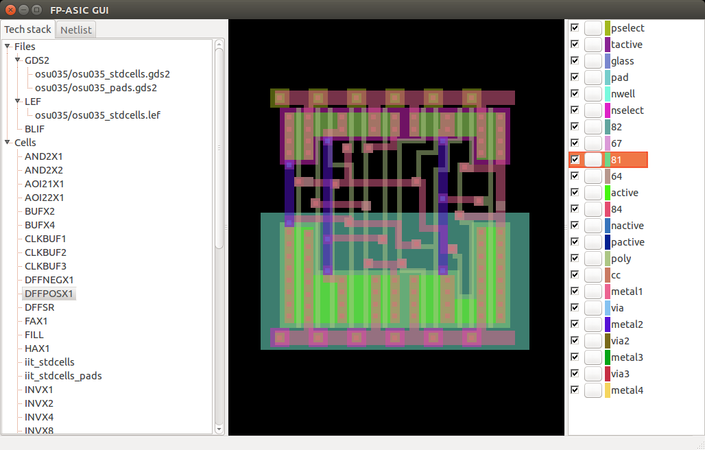
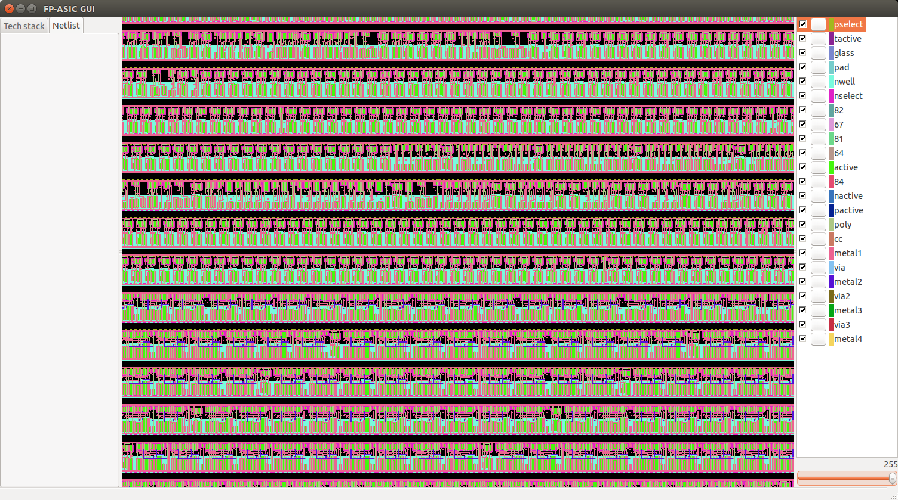

# fp-asic
A simple VLSI place and route framework/tool.

## GUI
To quickly visualize flows there's a small GUI:

Small piece of a [PicoRV32](https://github.com/cliffordwolf/picorv32) with AXI I/O laid out in rows:

